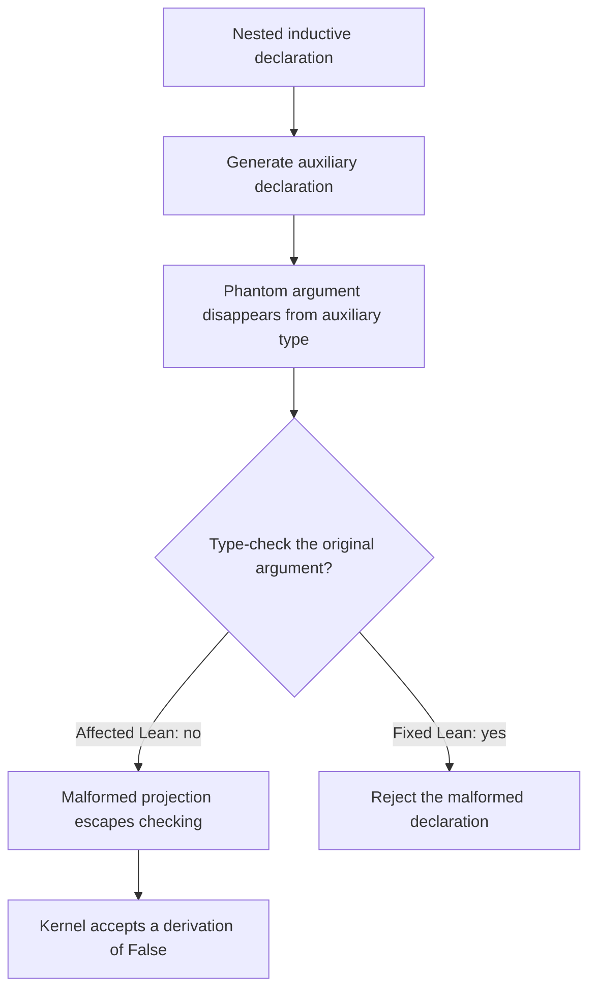
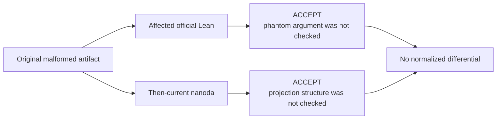

# Case Study: The 2026 Collatz False-Proof Incident

This case study examines a real Lean kernel soundness failure and asks the
question most relevant to this project:

> Would Lean Assurance Lab's mutation and differential testing approach have
> prevented it?

## Bottom Line

The purported Collatz disproof was not a mathematical counterexample. An
affected Lean kernel accepted a malformed declaration that could be reduced to
an axiom-free proof of `False`. This was a real implementation bug in Lean's
trusted kernel path, not a deliberately injected mutant.

The honest answer about prevention has two parts:

- **The known bug is caught now.** Lean Kernel Arena contains an exact regression
  test, and the current `nanoda` used by this project rejects it.
- **This project cannot claim it would have prevented the original incident.**
  The regression was added after disclosure, the current mutation campaign did
  not independently model the two defects involved, and the affected official
  Lean checker and the then-current `nanoda` both accepted the original artifact
  for different reasons. Comparing only those two normalized outcomes would
  have produced `ACCEPT == ACCEPT`, not a differential signal.

This is a retrospective case study, not evidence of prospective discovery.

## What Happened

On July 25, 2026, Ramana Kumar published an AI-assisted, `sorry`-free Lean
development claiming a nonterminating Collatz orbit and therefore a disproof of
the Collatz conjecture. The original repository exposed the declarations
`Collatz.exists_nonterminating_orbit` and `Collatz.not_conjecture` and pinned the
affected Lean/Mathlib version. See the
[original CollatzLean repository](https://github.com/xrchz/CollatzLean).

Reviewers did not find a genuine mathematical counterexample. Kiran Gopinathan
reduced the construction to an ordinary checked declaration proving `False`
without `sorry`, axioms, `unsafeCast`, an unchecked declaration path, or a
modified object file. The minimized report is
[Lean issue #14576](https://github.com/leanprover/lean4/issues/14576), titled
"Kernel accepts wrong-structure projections, allowing an axiom-free proof of
False."

Lean maintainer Leonardo de Moura published a detailed
[official postmortem](https://leodemoura.github.io/blog/2026-8-1-postmortem-for-kernel-soundness-bug-14576/).
The fix was merged as
[Lean pull request #14577](https://github.com/leanprover/lean4/pull/14577) on
July 28. The correction is also recorded in the
[Lean 4.33.0 release notes](https://lean-lang.org/doc/reference/latest/releases/v4.33.0/).
The [Openwall oss-security report](https://www.openwall.com/lists/oss-security/2026/08/02/1)
provides an independent security-oriented account.

## What Failed in the Kernel

Lean transforms nested inductive declarations into auxiliary declarations
before checking them. In the affected path, a parameter that did not appear in
the generated auxiliary type could be dropped without its original argument
being type-checked. Such an unused parameter is often called a **phantom
parameter**.

The Collatz artifact placed an ill-typed projection in that unchecked position.
The malformed term applied a projection belonging to one structure to a value
of an unrelated structure and used an identifier-hash collision to disguise
the mismatch. Once the bad parameter escaped checking, later declarations could
derive `False`.

The merged fix explicitly type-checks the original parameters that disappear
during nested-inductive compilation. This is an implementation repair to the
checker, not a change to the intended logic.



## Why a Second Checker Did Not Automatically Save It

The official postmortem reports that the then-current `nanoda` also accepted the
original Collatz development, but because of a **different bug**. `nanoda`
checked the nested-inductive condition that official Lean missed, yet failed to
verify that a projection node named the correct structure. That separate defect
was fixed independently.

Lean4Lean was also affected by the official nested-inductive defect because its
implementation followed the reference implementation in this area, while its
verification effort did not yet cover inductive declarations.



This is why checker count is not enough. Useful independent validation depends
on implementation diversity, compatible input handling, current versions, and
tests that exercise each implementation's distinct blind spots. Lean's
[proof validation guide](https://lean-lang.org/doc/reference/latest/ValidatingProofs/)
makes the same general limitation explicit: external checking helps with
implementation defects only when the same effective defect is not present in
every checker being relied upon.

## What the Current Project Catches

The current local Arena revision is
`f0fe3b379dbce91537417b529140d0ca250f271c`. It contains the test
`nested-unused-param`, added by
[Arena commit 289d09c](https://github.com/leanprover/lean-kernel-arena/commit/289d09c61e478a99fa49c9758746bd4587b337b3)
specifically for Lean issue #14576. The test exports `boom`, expects `reject`,
and describes the malformed projection and nested phantom parameter.

On August 24, 2026, this command against the project's current `nanoda` state:

```sh
cd external/lean-kernel-arena
../../.venv-arena/bin/python ./lka.py run \
  --checker nanoda \
  --test nested-unused-param
```

produced one correct rejection. The content-bound full baseline outcome also
records `nested-unused-param` as `REJECT` with correctness `correct`.

That establishes a narrow, useful fact: **the current target checker and corpus
catch the known regression**. It does not establish that the project would have
generated the test before the bug became public.

## Would Our Approach Have Prevented It?

| Interpretation | Answer | Reason |
| --- | --- | --- |
| Would the current corpus catch the published exploit class? | Yes. | The exact Arena regression now expects rejection, and current `nanoda` rejects it. |
| Would differential testing between the affected official Lean and then-current `nanoda` have raised an outcome difference? | No. | Both accepted the original artifact, although their implementation defects differed. |
| Did this project independently predict or discover the bug before disclosure? | No. | There is no pre-disclosure experiment, and the exact regression entered Arena after the report. |
| Does the current mutation model prove it would generate this witness? | No. | The campaign has not mechanically evaluated an exact phantom-parameter or wrong-projection-structure mutant with a held-out version of this witness. |
| Could this architecture prevent a future release containing a similar defect? | Conditionally. | It must generate or already contain a distinguishing input, compare against a checker or expected outcome that rejects it, and be enforced as a release gate. |

Lean Assurance Lab is assurance infrastructure, not a runtime shield around
every Lean proof. A testing signal prevents a release only when a release
process runs it and treats the result as blocking.

## The Next Honest Experiment

Prerequisite status as of 2026-08-24: **ready to freeze**. The current
official/Kiota disagreement has a mechanically reproduced, upstream-ready
report, and new rotating full-corpus executions have durable checkpoint/resume
support. Neither prerequisite is evidence that the retrospective will succeed.

A useful retrospective experiment would test capability without feeding the
known witness directly into generation:

1. Pin the affected official Lean revision and the pre-fix `nanoda` revision.
2. Freeze an Arena corpus from before commit `289d09c`, excluding the disclosed
   regression and derivatives.
3. Introduce independently specified mutation operators for dropped
   nested-inductive parameter validation and projection-structure identity.
4. Run coverage-guided mutation evaluation and bounded witness generation with
   fixed seeds and budgets.
5. Keep the published Collatz and `nested-unused-param` artifacts held out until
   evaluation.
6. Check whether generation rediscovers a distinguishing artifact and whether a
   genuinely independent, fixed checker rejects it.
7. Record failure to rediscover the behavior just as carefully as success.

That experiment could show that the machinery is capable of finding this bug
class under stated retrospective conditions. It still would not prove that an
unbounded, previously unknown version of the same bug would always be found.

## Sources

- [Official Lean kernel soundness postmortem](https://leodemoura.github.io/blog/2026-8-1-postmortem-for-kernel-soundness-bug-14576/)
- [Lean issue #14576: minimized proof of False](https://github.com/leanprover/lean4/issues/14576)
- [Lean pull request #14577: kernel fix](https://github.com/leanprover/lean4/pull/14577)
- [Lean 4.33.0 release notes](https://lean-lang.org/doc/reference/latest/releases/v4.33.0/)
- [Original CollatzLean repository](https://github.com/xrchz/CollatzLean)
- [Lean proof validation guide](https://lean-lang.org/doc/reference/latest/ValidatingProofs/)
- [Openwall oss-security report](https://www.openwall.com/lists/oss-security/2026/08/02/1)
- [Lean Kernel Arena regression commit](https://github.com/leanprover/lean-kernel-arena/commit/289d09c61e478a99fa49c9758746bd4587b337b3)
