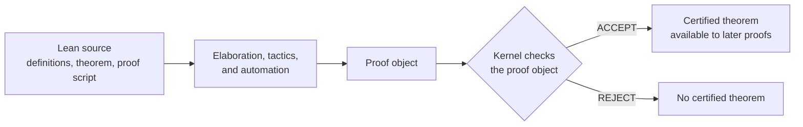
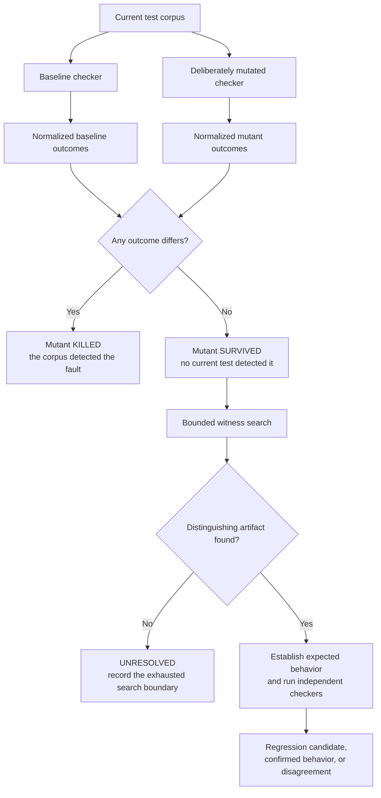

# Why Test a Proof Kernel?

This introduction assumes no familiarity with Lean, proof assistants, kernels,
or mutation testing. It explains the problem this project addresses, what its
experiments can establish, and what they cannot.

For the latest measured results, read [Public Status](PUBLIC_STATUS.md) after
this page.

## The Short Version

Lean is a system for writing definitions, programs, mathematical statements,
and machine-checkable proofs. A small program called the **kernel** makes the
final decision about whether a proof follows Lean's logical rules.

That architecture concentrates trust in a relatively small checker. It does not
make trust disappear. If the kernel accidentally accepts an invalid proof
object, downstream users can receive a theorem marked as proved even though the
required logical justification was not present.

LeanVerifier measures how well tests detect plausible mistakes in proof
checkers. It deliberately introduces faults into checker copies, runs the same
test corpus against the original and faulty versions, and compares normalized
outcomes. Surviving faults guide the search for new distinguishing tests.

The project does not prove that Lean is correct. It builds reproducible evidence
about exact checker versions, test corpora, modeled faults, generated tests, and
unresolved disagreements.

## What Is Lean?

Lean is both a programming language and an interactive theorem prover. A theorem
prover helps people express precise claims and construct proofs that a computer
can check.

A traditional mathematical proof is read and judged by people. A Lean proof is
translated into a formal proof object whose individual steps can be checked
against a small set of logical rules. This makes proofs repeatable: another
machine can run the checker instead of relying only on the author's reputation,
memory, or prose.

Lean can be used for formalized mathematics and for reasoning about software or
other precisely modeled systems. Its value is not that a computer invents truth
automatically. Its value is that important claims and their justifications can
be stated precisely enough for independent mechanical checking.

## What Does the Kernel Do?

Lean contains convenient, sophisticated components that parse source code,
infer omitted information, run tactics, search for proofs, compile programs,
and present results. Those components may produce a proof object, but they do
not get the final word about logical validity.

The kernel checks that the proof object has the claimed theorem as its type
according to Lean's formal rules. If checking succeeds, the theorem may be
added to the environment and used by later proofs. If checking fails, the
theorem is not certified.



This is sometimes called a **trust funnel**. Large and complicated tools can be
useful without every one of them becoming the final authority, because the
kernel rechecks their output.

The funnel narrows the trusted core, but several kinds of trust remain:

- the logical rules must express the intended foundation;
- the kernel implementation must enforce those rules correctly;
- the executable must correspond to the intended source and build;
- the runtime, operating system, and hardware must execute it faithfully;
- inputs and outputs must be interpreted without silently changing their
  meaning.

LeanVerifier focuses on measurable checker behavior. It is one assurance layer,
not a solution to every part of the trusted computing base.

In this repository, **checker** and **validator** are broader operational terms
for programs that validate exported Lean declarations. Some are intended as
kernel implementations; others are independent reimplementations with their own
architecture and compatibility boundaries. Every report names the exact program
and role instead of assuming that all validators are interchangeable.

## What Is the Trust Problem?

The kernel is the component that turns a proposed proof into an accepted
theorem. A defect in ordinary editor tooling may be inconvenient. A semantic
defect in the kernel can be more consequential: it may allow a malformed proof
object or declaration to enter an environment as if it were valid.

Keeping the kernel small makes review and independent implementation more
tractable, but small programs can still contain subtle mistakes. Proof checking
includes difficult behavior involving universes, substitution, reduction,
inductive types, recursion, and definitional equality. Many errors appear only
on unusual combinations that normal examples never exercise.

There is no single button that removes this trust problem. Useful assurance can
come from several sources:

- careful implementation and code review;
- formal specification and verification;
- conformance and regression tests;
- independent checker implementations;
- fuzzing, property testing, and differential testing;
- mutation testing that measures whether tests detect modeled faults.

These techniques complement one another. Testing supplies concrete behavioral
evidence, but passing tests never proves the absence of all defects.

## Where Lean Kernel Arena Fits

Lean Kernel Arena supplies a common collection of exported Lean declarations
and adapters for running multiple proof checkers. Rather than asking each
implementation to understand Lean source syntax, the Arena materializes
structured artifacts that describe declarations for a checker to validate.

LeanVerifier uses that corpus as experimental input. It builds checker states,
runs the same artifacts through them, normalizes implementation-specific process
behavior into a shared outcome vocabulary, and stores content-addressed
comparisons.

This boundary matters. A result can depend on the exporter version, artifact
format, parser behavior, checker configuration, and Lean version as well as the
semantic rule under investigation. The project binds those identities and uses
positive controls before interpreting cross-checker differences semantically.

## What Is Mutation Testing?

Ordinary tests ask whether the current implementation behaves as expected.
Mutation testing asks a different question:

> Would these tests notice if the implementation contained a plausible small
> mistake?

A **mutant** is a deliberately modified checker. For example, suppose the
baseline checker contains a validation step conceptually like:

```text
require(theorem_type_is_a_proposition)
```

A mutation operator might remove that validation in an isolated checker copy.
The original and mutated checkers then receive exactly the same inputs.



The central experimental predicate is deliberately simple:

```text
baseline_checker(input) != mutated_checker(input)
```

Humans or language models may propose mutations and candidate inputs. They do
not decide whether the predicate succeeded. Two recorded checker runs do.

## Essential Vocabulary

| Term | Meaning in this project |
| --- | --- |
| Baseline | The unmodified checker state used for comparison. |
| Mutant | A checker copy containing an intentionally introduced fault. |
| Corpus | The collection of inputs used to exercise checkers. |
| Killed mutant | At least one corpus input produced a different normalized outcome between baseline and mutant. |
| Surviving mutant | Every executed applicable test produced the same normalized outcome in both states. |
| Witness | An input that mechanically distinguishes two checker states. |
| Mutation score | The fraction of an explicitly scoped mutant population killed by a corpus. |
| Coverage | Evidence that a test executed a source location; it does not establish that the test checked the location's semantics. |
| Differential testing | Running the same input through different checker states or implementations and comparing outcomes. |
| Regression candidate | A generated artifact with mechanically established expected behavior that may strengthen a shared corpus. |
| Checker disagreement | Compatible unmodified checkers produced different semantic or parse outcomes. The disagreement remains unresolved until adjudicated. |

## What a Result Does and Does Not Mean

### A killed mutant

A killed mutant shows that the tested corpus detects that exact injected fault
under the recorded configuration. It does not show that the original checker
contained the fault.

### A surviving mutant

A surviving mutant identifies a gap relative to the modeled fault: no selected
test distinguished the original and faulty states. It does not by itself show
that the mutant is equivalent, that the original checker is buggy, or that a
real user can construct a harmful input.

### A generated witness

A witness proves that the two checker states differ on one exact artifact. More
work is still needed to determine which outcome matches the intended semantics.
A mutation-testing distinction and an expected-semantics judgment are separate
pieces of evidence.

### A disagreement between unmodified checkers

A disagreement is a potential signal of a real implementation, compatibility,
or interpretation problem. It is not automatically a confirmed bug. This
project does not decide semantics by counting implementations or taking a
majority vote.

### A high mutation score

A mutation score describes only the selected mutation model and corpus. A score
of 100 percent would not prove the absence of unmodeled mistakes. A lower score
can be useful because it identifies specific assurance work to do next.

## A Real Incident: The 2026 Collatz False-Proof

In July 2026, an affected Lean kernel accepted a `sorry`-free development that
claimed a nonterminating Collatz orbit. Reviewers reduced it to an axiom-free
proof of `False`: the result was not a mathematical disproof of Collatz, but a
real kernel implementation bug. Lean's
[official postmortem](https://leodemoura.github.io/blog/2026-8-1-postmortem-for-kernel-soundness-bug-14576/),
[issue #14576](https://github.com/leanprover/lean4/issues/14576), and
[fix #14577](https://github.com/leanprover/lean4/pull/14577) document the
incident.

This example also exposes a limit of simple differential checking: the affected
official Lean checker and the then-current `nanoda` both accepted the original
artifact because of different bugs. Comparing only those two accept/reject
outcomes would not have raised a difference.

The exact regression is now in Lean Kernel Arena and current `nanoda` rejects
it. That is retrospective protection against the known exploit, not proof that
LeanVerifier would have discovered or prevented it before disclosure. Read the
[Collatz incident case study](CASE_STUDY_COLLATZ.md) for the technical cause,
primary sources, current mechanical evidence, and the experiment needed to test
that counterfactual honestly.

## One Concrete Project Example

The current project includes a deliberately introduced `nanoda` mutant that
removes validation of universe-level ownership for referenced constants.
Universe levels are part of Lean's mechanism for organizing types while
avoiding logical paradoxes.

The existing 197-test materialized corpus produced no normalized difference for
that mutant, so the mutant survived. A structure-aware search then generated an
artifact for which baseline `nanoda` rejected and the mutant accepted. That
mechanically established a witness and showed that the mutation was not merely
behaviorally equivalent on all possible inputs.

The story did not end with the distinction. Unmodified official Lean rejected
the generated artifact, while unmodified Kiota accepted it. The project
therefore records an unresolved semantic checker disagreement. It does not call
the injected mutant a discovered bug, and it does not declare either unmodified
checker wrong by vote.

This example captures the complete philosophy:

1. model a plausible fault;
2. measure whether the current corpus detects it;
3. search mechanically when it survives;
4. minimize and preserve a distinguishing artifact;
5. establish expected behavior and consult independent implementations;
6. retain disagreement when the evidence does not yet adjudicate it.

## Why Independent Checkers Matter

Two implementations can share a specification without sharing all source code,
language choices, internal algorithms, or local mistakes. Agreement across
compatible independent checkers can increase confidence that a result is not an
artifact of one implementation.

Independence is not magic. Implementations may share ambiguities, exported input
formats may be incompatible, and agreement can still be wrong. LeanVerifier
therefore records exact versions, implementation families, controls, raw
behavior, and compatibility evidence. It preserves exceptional outcomes such as
crashes, timeouts, declines, and parse failures instead of collapsing everything
into pass or fail.

## Why Coverage Helps But Is Not Enough

Running every test against every mutant is expensive, especially when corpus
artifacts contain large formal libraries. Per-test coverage lets the project
schedule only tests that executed the mutated source location, often placing
fast tests first.

Coverage answers **whether code ran**, not **whether its semantic behavior was
adequately challenged**. A line may execute thousands of times without any test
checking the boundary condition changed by a mutant. Coverage is therefore an
execution optimization and diagnostic measurement, not the success criterion.
Periodic full-corpus controls check that coverage guidance has not changed the
conclusion.

## How to Read the Current Status

[Public Status](PUBLIC_STATUS.md) is generated from the versioned assurance
snapshot. It is the best short answer to:

- Which exact evidence is current?
- Does the current assurance gate pass or fail?
- Why does it have that status?
- How many modeled mutants, searches, disagreements, and held-out folds were
  measured?
- What does the project explicitly not claim?

A milestone gate and the current assurance gate answer different questions. A
milestone gate asks whether required machinery and reporting were implemented
correctly. The current assurance gate asks whether today's measured evidence
meets the configured hard conditions. It is possible, and honest, for the
implementation milestone to pass while the current measurement fails because a
real unresolved state remains visible.

## Questions Worth Asking

### About Lean and trust

- What part of a Lean proof is checked by the kernel?
- Which components are inside and outside the trusted computing base for this
  claim?
- What kinds of implementation mistakes could admit an invalid declaration?
- How do formal verification, testing, and independent implementations provide
  different kinds of assurance?

### About an experiment

- Is the fault deliberately injected or observed in an unmodified checker?
- What exact source revision, binary, configuration, and corpus were used?
- Was the mutated location covered by the selected tests?
- What executable condition determines success?
- Did every applicable test run, or was the experiment bounded?
- Were the baseline source and binary restored after mutation?

### About a result

- Does the evidence establish a checker difference, expected semantics, or
  both?
- Could a difference be caused by parsing or format incompatibility?
- Is a survivor meaningful, equivalent, unreachable, or still unresolved?
- Does the mutation score have a representative denominator?
- Are negative and inconclusive results retained?
- Is any claim broader than the exact evidence supports?

### About generated tests and disagreements

- How was the candidate generated, and was randomness reproducible?
- Was held-out checker feedback excluded before a transfer corpus was frozen?
- What positive control establishes format compatibility?
- Who or what mechanically established the expected outcome?
- Are independent checker outcomes preserved without majority voting?
- Is the artifact ready as a regression, or does disagreement remain attached?

### About the project itself

- Can a fresh process reproduce the current claim from durable artifacts?
- Which large local payloads are represented only by content-addressed
  manifests?
- What becomes stale when a checker, corpus, policy, or expected outcome changes?
- What is the next unresolved question with the greatest assurance value?
- How can a validator author, Lean user, researcher, or documentation
  contributor improve the evidence?

## Choose A Reading Path

### I have five minutes

1. Read [The Short Version](#the-short-version).
2. Scan the trust-funnel and mutation-workflow diagrams.
3. Read [Public Status](PUBLIC_STATUS.md) for the current measurements and
   limits.

### I want to understand the evidence model

1. Read the [Constitution](../CONSTITUTION.md) for the governing standards.
2. Read the [Design](DESIGN.md) for execution, normalization, and artifact flow.
3. Read the [Mutation Model](MUTATION_MODEL.md) for the modeled fault families.
4. Inspect [Research Status](RESEARCH_STATUS.md) for the experiment record and
   unresolved work.

### I want to reproduce results

1. Follow the commands in the [README](../README.md) from the lightweight
   assurance checks toward the more expensive corpus runs.
2. Inspect `results/assurance/current.json` for content-bound inputs and gate
   evidence.
3. Run `scripts/artifact-status --require-current` before treating a report as a
   current claim.

Paths in the last two steps are relative to the repository root.

### I want to contribute

[Contributing](../CONTRIBUTING.md) defines seven contribution paths, required
metadata, mechanical evidence standards, issue forms, and review criteria.
Contributions do not need to produce a positive result. A reproducible negative,
neutral, incompatible, or unresolved result can improve the project's account
of what is known.

## What Success Looks Like

The project does not succeed only when it finds a dramatic bug. It succeeds when
the Lean community receives a more accurate and reproducible account of its
validation evidence: stronger shared tests when gaps are confirmed, clearer
specifications when behavior is ambiguous, durable disagreements when evidence
conflicts, and explicit limits where measurement remains incomplete.

That is the practical answer to the trust problem: not a declaration that trust
is solved, but infrastructure that makes the basis for trust visible,
challengeable, and steadily improvable.
